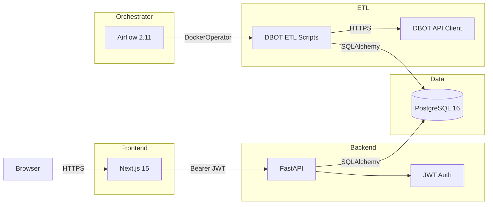

# DBOT Stock Signals Tracker

## Project Overview

Monorepo tracking DBOT stock buy/sell signals with daily ETL.

## Architecture



| Layer | Tech | Port |
|-------|------|------|
| PostgreSQL | Database | 5432 |
| FastAPI | Backend API | 8000 |
| Airflow 2 | ETL Orchestrator | 8080 |
| Next.js | Frontend | 3000 |

## Quick Start

```bash
cp .env.example .env
# Edit .env — set SECRET_KEY and NEXTAUTH_SECRET
# Generate SECRET_KEY: python3 -c "import secrets; print(secrets.token_urlsafe(48))"
# Generate NEXTAUTH_SECRET: openssl rand -base64 32

docker compose up -d
# or: make up
```

## API Endpoints

| Method | Path | Auth |
|--------|------|------|
| POST | `/api/v1/auth/register` | No |
| POST | `/api/v1/auth/login` | No |
| GET | `/api/v1/auth/me` | Bearer JWT |
| GET | `/api/v1/stocks` | Bearer JWT |
| GET | `/api/v1/signals?date=YYYY-MM-DD&future_days=N` | Bearer JWT |
| PATCH | `/api/v1/admin/dbot-token` | Bearer JWT + Admin |

## Database Schema

- `users` — App users (username/password), `is_admin` flag
- `dbot_token` — Stored DBOT Bearer token (encrypted at rest via Fernet)
- `stocks` — Stock symbols (PK: symbol), filtered index symbols
- `stock_daily_data` — Daily OHLCV + signals (unique: symbol + date)

## Airflow DAGs

Naming convention: `[job_type]_[worker_type]_[description].py`

- `etl_local_initial_dump.py` — One-time historical data backfill (manual trigger)
- `etl_local_daily_dbot.py` — Daily ETL at 15:00 Mon-Fri

### Setting up DBOT Token

1. Get Bearer token from browser DevTools
2. Login to app → get JWT
3. `PATCH /api/v1/admin/dbot-token` with `{"token": "..."}` (admin only)
4. Or insert directly into `dbot_token` table

## Development Commands

```bash
# Start all services
make up

# Stop all services
make down

# Backend only (local, needs postgres running)
make dev-backend

# Frontend only (local)
cd frontend && pnpm dev

# Backend tests
make test-backend

# Format & lint
make format
make lint

# Database migration
make migrate m="description"
make init-db
```

## Auth Flow

1. User logs in via `/login` (NextAuth Credentials)
2. Backend validates username/password (bcrypt) → returns JWT (4h expiry)
3. Frontend stores JWT via NextAuth (httpOnly cookie) with expiry tracking
4. All API calls include `Authorization: Bearer <token>`
5. Middleware + client auto-redirect to `/login` when JWT expires

## Important Notes

- DBOT token expires ~7 days. Update via admin API when expired.
- Initial dump DAG must be triggered manually from Airflow UI.
- Daily ETL runs at 15:00 Vietnam time (Mon-Fri).
- Index symbols (VNINDEX, VNXALL, etc.) are filtered out automatically.
- Signal for a stock on a given day can be `NULL` (no signal), `BUY`, or `SELL`.
- Admin users cannot deactivate their own account (protected API).
- Non-admin users are blocked from `/admin/*` routes at the frontend middleware level.
- Swarm deploy uses Docker secrets for `SECRET_KEY` and `POSTGRES_PASSWORD`.
- Backend image (`dbot-backend:latest`) is single source of truth for both API and ETL.

## Tech Stack & Best Practices

### Backend
- **FastAPI** + **SQLAlchemy 2.0** (async) + **Pydantic v2**
- **Repository Pattern**: 1 file per repository class
- **Service Layer**: Business logic + transaction management
- **Security**: JWT with `iss`/`aud`/`iat`/`jti` claims (PyJWT), bcrypt password hashing, Fernet encryption for DBOT token
- **Ruff**: Lint + format with `E,F,I,N,W,UP,B,C4,SIM,ARG` rules
- **Logging**: Structured `[timestamp] [level] message` via `logging` module

### Frontend
- **Next.js 15** App Router + **React 19**
- **Tailwind CSS** for styling
- **TanStack Table** for data tables
- **SWR** for client-side data fetching (caching, dedup, error retry)
- **React Hook Form** + **Zod** for form validation
- **NextAuth.js v4** with Credentials provider + JWT expiry tracking

### Airflow
- **Airflow 2.11.2** with LocalExecutor
- **Naming convention**: `[job_type]_[worker_type]_[description].py`
- `dag_id = os.path.basename(__file__).replace(".py", "")`
- Zero business logic in DAGs — DockerOperator pulls backend image

## File Structure

```
.
├── backend/              FastAPI app
│   ├── app/
│   │   ├── api/v1/       API routes (auth, stocks, signals, admin)
│   │   ├── core/         Config (Pydantic Settings), DB, Security, Encryption
│   │   ├── etl/          Shared ETL module (sync DB + crawler)
│   │   ├── models/       SQLAlchemy 2.0 models
│   │   ├── repositories/ DB access layer (User, Stock, Daily, Token)
│   │   ├── schemas/      Pydantic v2 schemas + validation
│   │   └── services/     Business logic (Auth, Stock, Signal, Token)
│   ├── scripts/          Standalone ETL scripts (daily, initial)
│   ├── alembic/          DB migrations (001, 002, 003)
│   └── Dockerfile        Multi-stage build
├── airflow/
│   ├── dags/             DAG definitions (self-contained, no shared config)
│   │   ├── etl_local_initial_dump.py
│   │   └── etl_local_daily_dbot.py
│   └── Dockerfile        Airflow 2.11.2 + providers
├── frontend/
│   ├── app/              Next.js App Router
│   │   ├── api/auth/     NextAuth API route
│   │   ├── login/        Login page (RHF + Zod)
│   │   ├── loading.tsx   Loading UI
│   │   ├── error.tsx     Error boundary
│   │   └── not-found.tsx 404 page
│   ├── components/       UI components
│   ├── features/
│   │   └── signals/      Dashboard + TanStack Table
│   ├── lib/              Shared utilities (api client, auth, schemas)
│   └── types/            TypeScript type definitions
├── docker/
│   └── postgres/
│       └── init.sql      Auto-create airflow DB
├── docker-compose.yml        Local dev
├── docker-compose.swarm.yml  Production Swarm
├── Makefile                  Dev commands
├── .env.example              Required env vars template
└── .github/workflows/
    └── ci-cd.yml             Build + push Docker image
```

## Deploy

- **Local**: `make up` or `docker compose up -d`
- **Frontend**: Vercel (set Root Directory = `frontend/`)
- **Backend + Airflow**: EC2 with Docker Swarm (`make deploy-swarm`)

## Logging Conventions

| Source | Logger | Example |
|--------|--------|---------|
| Backend API | `dbot-backend` | `[2026-05-07 10:00:00] [INFO] GET /api/v1/signals — 200 (45.23ms)` |
| ETL Scripts | `dbot-etl` | `[2026-05-07 15:00:00] [INFO] Daily ETL completed: 875 records` |
| Frontend | `[CLIENT]` prefix | `[CLIENT] Signals fetch error: ...` |
