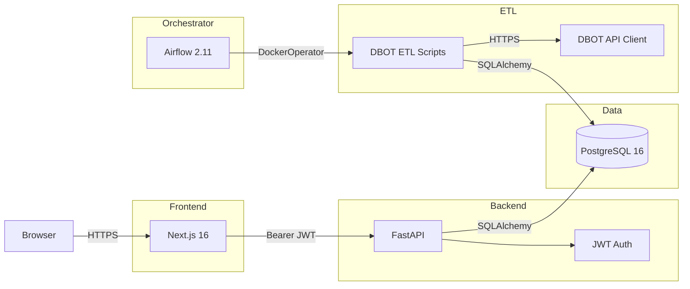

# DBOT Stock Signals Tracker

Monorepo tracking DBOT stock buy/sell signals with daily ETL.

## Architecture



| Layer | Tech | Port |
|-------|------|------|
| PostgreSQL | Database | 5432 |
| FastAPI | Backend API | 8000 |
| Airflow 2 | ETL Orchestrator | 8080 |
| Next.js | Frontend | 3000 |

## Quick Start

```bash
cp .env.example .env
cp frontend/.env.example frontend/.env
# Edit both .env files — set SECRET_KEY and NEXTAUTH_SECRET

make up                    # Start Postgres + Backend + Airflow
make init-db               # Run migrations
make create-admin ADMIN_USER=admin ADMIN_PASS=your-password
make dev-frontend          # Start frontend at http://localhost:3000
```

See [docs/development](docs/development/) for full development guide.

## Services

| Service | Local URL | Notes |
|---------|-----------|-------|
| Backend API | http://localhost:8000 | Auto-migrates on start |
| Airflow UI | http://localhost:8080 | Login: admin / admin |
| Frontend | http://localhost:3000 | `npm run dev` |
| PostgreSQL | localhost:5432 | DBs: `stock_signals`, `airflow` |

## Tech Stack

| Layer | Tech |
|-------|------|
| Database | PostgreSQL 16 |
| Backend | FastAPI, SQLAlchemy 2.0 (async), Pydantic v2, Alembic, PyJWT, uv |
| ETL | Airflow 2.11.2, DockerOperator |
| Frontend | Next.js 16, React 19, Tailwind CSS 4, TanStack Table, SWR, React Hook Form + Zod, NextAuth v4 |
| CI/CD | GitHub Actions, Docker Hub |
| Deploy | Oracle Cloud Free Tier + Cloudflare Tunnel |
| Infra (IaC) | Terraform, OCI Provider |

## Documentation

| Topic | File |
|-------|------|
| Development | [docs/development](docs/development/) |
| Deploy — Oracle Cloud | [docs/deploy/oracle-cloud.md](docs/deploy/oracle-cloud.md) |
| Deploy — Terraform | [docs/deploy/terraform.md](docs/deploy/terraform.md) |
| API Reference | [docs/api](docs/api/) |
| Frontend | [docs/frontend](docs/frontend/) |
| Airflow | [docs/airflow](docs/airflow/) |

## CI/CD

| Workflow | Triggers | Steps |
|----------|----------|-------|
| **Backend CI/CD** | Push to `main` + `backend/**` + `deploy:` / `deploy(be)` | uv → ruff → mypy → pytest → Docker build & push → Deploy to Oracle Cloud |
| **Frontend CI/CD** | Push to `main` + `frontend/**` + `deploy:` / `deploy(fe)` | `npm ci` → `tsc` → `eslint` → `prettier` → `next build` → Deploy to Vercel |

## Notes

- DBOT token expires ~7 days. Update via admin UI or `make update-dbtoken`.
- Index symbols (VNINDEX, VNXALL, etc.) are filtered automatically.
- Daily ETL runs at 15:00 Vietnam time (Mon–Fri).
- Admin users **cannot deactivate themselves or other admins**.
- Backups stream directly to Oracle Object Storage — no local retention.
- All frontend user-facing messages are in Vietnamese.
