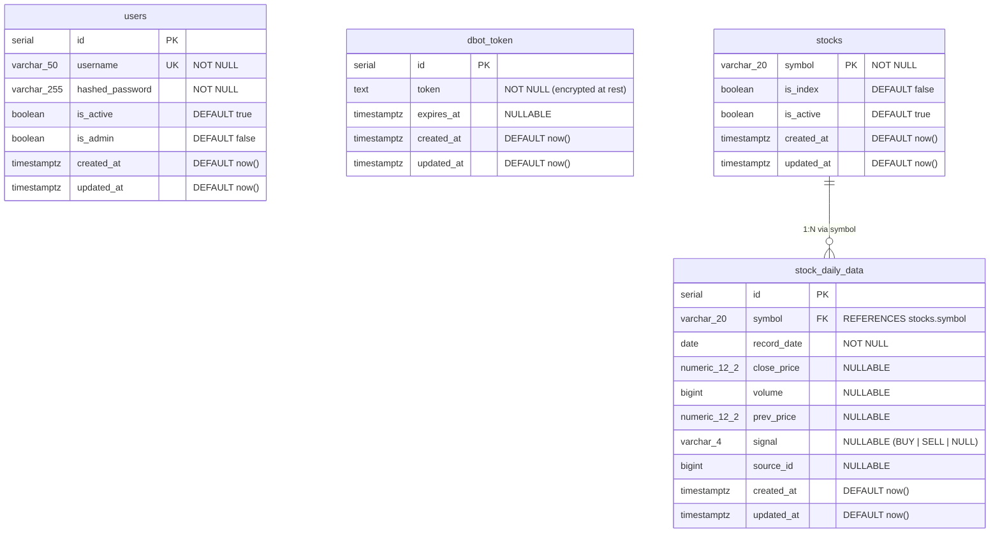

# DBOT Stock Signals Tracker — ER Diagram

**PostgreSQL 16**

## Schema Overview



## Table Details

### `users` — Application Users

| Column | Type | Constraints | Description |
|--------|------|-------------|-------------|
| `id` | `SERIAL` | **PK** | Auto-increment primary key |
| `username` | `varchar(50)` | **UK**, NOT NULL | Unique login identifier |
| `hashed_password` | `varchar(255)` | NOT NULL | Argon2/bcrypt hashed |
| `is_active` | `boolean` | DEFAULT true | Account status |
| `is_admin` | `boolean` | DEFAULT false | Admin role flag |
| `created_at` | `timestamptz` | DEFAULT now() | Record creation time |
| `updated_at` | `timestamptz` | DEFAULT now() | Last modified time |

**Notes:**
- Admin users cannot deactivate their own account (protected at API level).
- Passwords hashed with Argon2 (new) or bcrypt (legacy) via `passlib`.

---

### `dbot_token` — DBOT Bearer Token

| Column | Type | Constraints | Description |
|--------|------|-------------|-------------|
| `id` | `SERIAL` | **PK** | Auto-increment primary key |
| `token` | `text` | NOT NULL | Encrypted Bearer token (Fernet) |
| `expires_at` | `timestamptz` | NULLABLE | Token expiry (not actively used) |
| `created_at` | `timestamptz` | DEFAULT now() | Record creation time |
| `updated_at` | `timestamptz` | DEFAULT now() | Last modified time |

**Notes:**
- Only the **latest** token is used (ordered by `updated_at DESC`).
- Token encrypted at rest via Fernet (key derived from `SECRET_KEY`).
- Token expires ~7 days on DBOT API side; update via admin UI.

---

### `stocks` — Stock Symbols

| Column | Type | Constraints | Description |
|--------|------|-------------|-------------|
| `symbol` | `varchar(20)` | **PK** | Stock ticker (e.g., `VNM`) |
| `is_index` | `boolean` | DEFAULT false | True for market indices |
| `is_active` | `boolean` | DEFAULT true | Whether symbol is tracked |
| `created_at` | `timestamptz` | DEFAULT now() | Record creation time |
| `updated_at` | `timestamptz` | DEFAULT now() | Last modified time |

**Notes:**
- `is_index` set during initial dump to filter out `VNINDEX`, `VNXALL`, etc.
- Symbols upserted during initial dump and daily ETL.

---

### `stock_daily_data` — Daily OHLCV + Signals

| Column | Type | Constraints | Description |
|--------|------|-------------|-------------|
| `id` | `SERIAL` | **PK** | Auto-increment primary key |
| `symbol` | `varchar(20)` | **FK** → `stocks.symbol`, NOT NULL | Stock ticker |
| `record_date` | `date` | NOT NULL | Trading date (YYYY-MM-DD) |
| `close_price` | `numeric(12,2)` | NULLABLE | Closing price |
| `volume` | `bigint` | NULLABLE | Trading volume |
| `prev_price` | `numeric(12,2)` | NULLABLE | Previous close price |
| `signal` | `varchar(4)` | NULLABLE | `BUY`, `SELL`, or `NULL` |
| `source_id` | `bigint` | NULLABLE | DBOT API record ID |
| `created_at` | `timestamptz` | DEFAULT now() | Record creation time |
| `updated_at` | `timestamptz` | DEFAULT now() | Last modified time |

**Indexes:**

| Name | Columns | Type | Purpose |
|------|---------|------|---------|
| `uq_stock_date` | `symbol`, `record_date` | UNIQUE | Prevent duplicate data per day |
| `idx_daily_date_signal` | `record_date`, `signal` | INDEX | Filter by date + signal type |
| `idx_daily_symbol_date` | `symbol`, `record_date` | INDEX | Lookup single stock history |
| `idx_daily_source_id` | `source_id` | INDEX | Upsert deduplication by source ID |

**Notes:**
- Upsert logic: `ON CONFLICT (symbol, record_date) DO UPDATE`.
- `source_id` excluded from `SET` clause to avoid NULL overwrite on rerun.
- ~875 records/day after filtering index symbols.

## Relationships

```
stocks ||--o{ stock_daily_data : "1:N"
  stocks.symbol (PK) ──────> stock_daily_data.symbol (FK)
```

## Constraints Summary

| Constraint | Table | Columns | Rule |
|------------|-------|---------|------|
| PRIMARY KEY | `users` | `id` | Auto-increment |
| PRIMARY KEY | `dbot_token` | `id` | Auto-increment |
| PRIMARY KEY | `stocks` | `symbol` | Natural key |
| PRIMARY KEY | `stock_daily_data` | `id` | Auto-increment |
| UNIQUE | `users` | `username` | No duplicate usernames |
| UNIQUE | `stock_daily_data` | `symbol`, `record_date` | No duplicate daily data |
| FOREIGN KEY | `stock_daily_data` | `symbol` | REFERENCES `stocks(symbol)` |

## Query Script

`backend/scripts/query_table.py` connects safely:
- Reads `DATABASE_URL` from environment
- Converts `+asyncpg` → `+psycopg2` via `to_sync_url()`
- Uses SQLAlchemy `create_engine` with `pool_pre_ping=True`
- Whitelist 4 tables to prevent data leakage
- Bound parameter `:limit` prevents SQL injection
