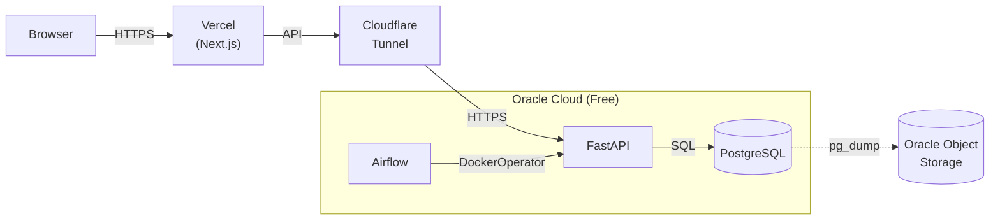

# Deploy — Oracle Cloud Free Tier

Production deploy guide for Oracle Cloud Always Free tier.

## Why Oracle Cloud?

- **Always Free**: Up to 4 OCPU + 24 GB RAM (Arm Ampere A1) + 200 GB block storage
- **No open ports needed**: Cloudflare Tunnel handles all inbound traffic
- **Total cost: $0/month**

## Architecture



## Step 1: Create Oracle Cloud VM

**Option A — Terraform (recommended):**

See [`docs/deploy/terraform.md`](./terraform.md) for Infrastructure-as-Code setup. This creates the VM, VCN, subnet, security rules, and Object Storage bucket in one command.

**Option B — Manual:**

1. Sign up at [cloud.oracle.com](https://cloud.oracle.com)
2. Create an **Always Free** Compute instance:
   - **Shape**: VM.Standard.A1.Flex (Arm, **2 OCPU + 12 GB RAM**)
   - **Image**: Canonical Ubuntu 22.04
   - **Boot volume**: 100 GB
3. Note the **Public IP** and download the private key

> **Tip:** Oracle Free Tier gives you 4 OCPU + 24 GB RAM total. Using 2 OCPU + 12 GB leaves plenty of headroom for this app while keeping resources available for other projects.

## Step 2: Initial Server Hardening

**Recommended:** Use `cloud-init` (paste into Oracle Console when creating the instance):

1. In Oracle Console → Create Instance → **Show advanced options**
2. Paste the contents of [`scripts/cloud-init.yaml`](../../scripts/cloud-init.yaml) into the **Cloud-init script** field
3. The VM will auto-harden on first boot

**Alternative:** Manual hardening after SSH:

```bash
ssh-copy-id -i ~/.ssh/oracle_key ubuntu@YOUR_ORACLE_IP
ssh -i ~/.ssh/oracle_key ubuntu@YOUR_ORACLE_IP

# Download and run setup script
curl -fsSL https://raw.githubusercontent.com/YOUR_REPO/dbot-tracking/main/scripts/setup-oracle.sh -o /tmp/setup-oracle.sh
chmod +x /tmp/setup-oracle.sh
sudo bash /tmp/setup-oracle.sh
```

What gets configured:
- System packages updated
- SSH: password auth disabled, root login disabled, key-only auth
- UFW: deny all incoming, allow SSH only
- fail2ban on SSH
- Docker + Docker Compose
- 2 GB swap
- Docker log rotation
- Automatic security updates

> **⚠️ Important:** SSH password authentication is disabled. Verify your SSH key works before disconnecting.

## Step 3: Clone Repository

```bash
git clone https://github.com/YOUR_REPO/dbot-tracking.git /opt/dbot-tracking
cd /opt/dbot-tracking
```

## Step 4: Configure Environment

```bash
cp .env.example .env
# Edit .env with production values:
#   - SECRET_KEY: generate with `python3 -c "import secrets; print(secrets.token_urlsafe(48))"`
#   - POSTGRES_PASSWORD: strong password
#   - CORS_ORIGINS: your Vercel domain
#   - REGISTRATION_DISABLED: true (disable public registration)
#   - CF_TUNNEL_TOKEN: from Cloudflare Tunnel setup (see Step 6)
#   - DOCKER_GID: run `getent group docker | cut -d: -f3` on the VM
#   - AIRFLOW_ADMIN_USER / AIRFLOW_ADMIN_PASSWORD: Airflow web UI credentials
#   - OOS_ACCESS_KEY, OOS_SECRET_KEY, OOS_NAMESPACE, OOS_REGION, OOS_BUCKET: for backups
nano .env
```

## Step 5: Deploy

```bash
cd /opt/dbot-tracking
make deploy-oracle
```

This will:
1. Create a pre-deploy database backup
2. Pull the latest backend image from Docker Hub
3. Build the Airflow image locally
4. Start all services with health checks
5. Clean up old Docker images (preserving images younger than 7 days for rollback)

### Rollback

```bash
cd /opt/dbot-tracking
make rollback-oracle
# Or: make rollback-oracle TAG=toilachuoituyet/dbot-backend:20260510-abc1234
```

## Step 6: Cloudflare Tunnel (Zero Trust)

1. In Cloudflare Dashboard → Zero Trust → Networks → Tunnels:
   - Create a tunnel → Connector → Docker
   - Copy the token
2. Add the token to `.env`: `CF_TUNNEL_TOKEN=your-token-here`
3. Configure public hostnames:
   - `api.yourdomain.com` → `http://backend:8000`
   - `airflow.yourdomain.com` → `http://airflow:8080`
4. Redeploy: `make deploy-oracle`

## Step 7: Deploy Frontend to Vercel

Frontend deploys automatically via GitHub Actions when pushing to `main` with `deploy:` or `deploy(fe)` in the commit message.

1. Create a Vercel project and link it locally:
   ```bash
   cd frontend
   npx vercel@latest link
   ```
2. Copy `orgId` and `projectId` from `.vercel/project.json` into GitHub Secrets (`VERCEL_ORG_ID`, `VERCEL_PROJECT_ID`)
3. Create a Vercel personal access token and add it to GitHub Secrets as `VERCEL_TOKEN`

## Step 8: Admin Setup

```bash
cd /opt/dbot-tracking
docker compose -f docker-compose.prod.yml exec backend python scripts/create_admin.py --username admin --password YOUR_STRONG_PASSWORD
docker compose -f docker-compose.prod.yml exec backend python scripts/update_dbot_token.py "<BEARER_TOKEN>"
```

Trigger initial data backfill from Airflow UI: `https://airflow.yourdomain.com`

## Step 9: Automated Backups

```bash
# Create log directory
mkdir -p /opt/dbot-tracking/logs

# Add to crontab (runs daily at 3 AM)
(crontab -l 2>/dev/null; echo "0 3 * * * /opt/dbot-tracking/scripts/backup.sh >> /opt/dbot-tracking/logs/backup.log 2>&1") | crontab -
```

Backups are streamed directly to **Oracle Object Storage** — no local copy is retained.

### Oracle Object Storage Setup

> **If you used Terraform:** The bucket `dbot-backups` is already created. Skip step 2. Get `OOS_NAMESPACE` and `OOS_BUCKET` from Terraform outputs (`bucket_namespace`, `bucket_name`).

1. OCI Console → **Identity** → **Users** → **Customer Secret Keys** → Generate Key
2. **Storage** → **Buckets** → Create Bucket (Standard, same region as VM) — skip if created by Terraform
3. Add to `.env`:
   ```
   OOS_ACCESS_KEY=your-access-key
   OOS_SECRET_KEY=your-secret-key
   OOS_NAMESPACE=your-namespace
   OOS_REGION=your-region
   OOS_BUCKET=dbot-backups
   ```
4. Install rclone: `sudo apt install rclone`

## GitHub Actions Auto-Deploy

### Backend Secrets (Oracle Cloud)

| Secret | Value |
|--------|-------|
| `DOCKERHUB_USERNAME` | Your Docker Hub username |
| `DOCKERHUB_TOKEN` | Docker Hub access token |
| `ORACLE_HOST` | Oracle VM public IP |
| `ORACLE_USER` | `ubuntu` |
| `ORACLE_SSH_KEY` | Private key content (entire file) |
| `ORACLE_API_DOMAIN` | Domain serving the backend API |

Backend deploy triggers on `deploy:` or `deploy(be)` in the commit message. Frontend deploy triggers on `deploy:` or `deploy(fe)`. Manual `workflow_dispatch` works for both.

### Frontend Secrets (Vercel)

| Secret | Value |
|--------|-------|
| `VERCEL_TOKEN` | Vercel personal access token |
| `VERCEL_ORG_ID` | Your Vercel Team/User ID |
| `VERCEL_PROJECT_ID` | Your Vercel project ID |

## Security Checklist

- [ ] SSH password auth disabled
- [ ] Root login disabled
- [ ] SSH key-only authentication
- [ ] UFW active, deny all incoming
- [ ] fail2ban active on SSH
- [ ] No ports open on Oracle Cloud security group (except SSH)
- [ ] All services behind Cloudflare Tunnel
- [ ] `REGISTRATION_DISABLED=true` in production
- [ ] `SECRET_KEY` ≥ 32 bytes, randomly generated
- [ ] Automatic security updates enabled
- [ ] Docker log rotation configured
- [ ] Database backups scheduled
- [ ] Airflow admin password changed from default

## Troubleshooting

**Out of memory (OOM):**
```bash
free -h
sudo fallocate -l 4G /swapfile2 && sudo chmod 600 /swapfile2 && sudo mkswap /swapfile2 && sudo swapon /swapfile2
```

**Services not starting:**
```bash
cd /opt/dbot-tracking
docker compose -f docker-compose.prod.yml logs -f
```

**Verify tunnel is working:**
```bash
# From your local machine
curl --fail https://api.yourdomain.com/health
curl --fail https://airflow.yourdomain.com/health
```

**Locked out of SSH:**
Use Oracle Cloud Console → Instance Details → Console Connection → VNC/Serial Console.
