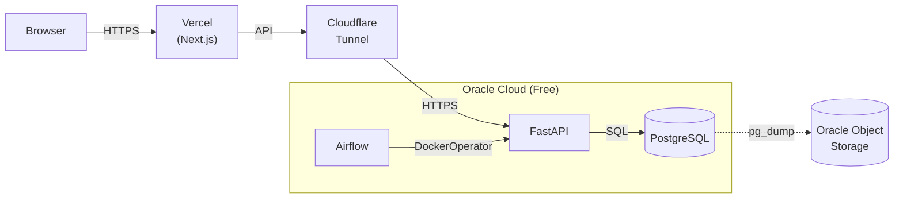

# Deploy — Oracle Cloud Free Tier

Production deploy guide for Oracle Cloud Always Free tier.

## Why Oracle Cloud?

- **Always Free**: 2 AMD VM instances + 200 GB block storage
- **No open ports needed**: Cloudflare Tunnel handles all inbound traffic
- **Total cost: $0/month**

## Architecture



## Step 1: Create Oracle Cloud VM

1. Sign up at [cloud.oracle.com](https://cloud.oracle.com)
2. Create an **Always Free** Compute instance:
   - **Shape**: VM.Standard.A1.Flex (Arm, **2 OCPU + 12 GB RAM**)
   - **Image**: Canonical Ubuntu 22.04
   - **Boot volume**: 50 GB
3. Note the **Public IP** and download the private key

> **Tip:** Oracle Free Tier gives you 4 OCPU + 24 GB RAM total. Using 2 OCPU + 12 GB leaves plenty of headroom for this app while keeping resources available for other projects.

## Step 2: Initial Server Hardening

```bash
ssh-copy-id -i ~/.ssh/oracle_key ubuntu@YOUR_ORACLE_IP
ssh -i ~/.ssh/oracle_key ubuntu@YOUR_ORACLE_IP

curl -fsSL https://raw.githubusercontent.com/YOUR_REPO/dbot-tracking/main/scripts/setup-oracle.sh | sudo bash
```

This script will:
- Update system packages
- Disable password & root SSH login
- Configure UFW firewall (deny all incoming)
- Install fail2ban
- Install Docker + Docker Compose
- Setup 2 GB swap
- Configure Docker log rotation
- Enable automatic security updates

> **⚠️ Important:** The setup script disables SSH password authentication. Make sure your SSH key is working before disconnecting.

## Step 3: Clone Repository

```bash
git clone https://github.com/YOUR_REPO/dbot-tracking.git /opt/dbot-tracking
cd /opt/dbot-tracking
```

## Step 4: Configure Environment

```bash
cp .env.example .env
# Edit .env with production values:
#   - SECRET_KEY: generate with `python3 -c "import secrets; print(secrets.token_urlsafe(48))"`
#   - POSTGRES_PASSWORD: strong password
#   - CORS_ORIGINS: your Vercel domain
#   - CF_TUNNEL_TOKEN: from Cloudflare Tunnel setup (see Step 6)
#   - OOS_ACCESS_KEY, OOS_SECRET_KEY, OOS_NAMESPACE, OOS_REGION, OOS_BUCKET: for backups
nano .env
```

## Step 5: Deploy

```bash
cd /opt/dbot-tracking
make deploy-oracle
```

This will:
1. Create a pre-deploy database backup
2. Pull the latest backend image from Docker Hub
3. Build the Airflow image locally
4. Start all services with health checks
5. Clean up old Docker images (preserving images younger than 7 days for rollback)

### Rollback

```bash
cd /opt/dbot-tracking
make rollback-oracle
# Or: make rollback-oracle TAG=toilachuoituyet/dbot-backend:20260510-abc1234
```

## Step 6: Cloudflare Tunnel (Zero Trust)

1. In Cloudflare Dashboard → Zero Trust → Networks → Tunnels:
   - Create a tunnel → Connector → Docker
   - Copy the token
2. Add the token to `.env`: `CF_TUNNEL_TOKEN=your-token-here`
3. Configure public hostnames:
   - `api.yourdomain.com` → `http://backend:8000`
   - `airflow.yourdomain.com` → `http://airflow:8080`
4. Redeploy: `make deploy-oracle`

## Step 7: Deploy Frontend to Vercel

Frontend deploys automatically via GitHub Actions on every push to `main`.

1. Create a Vercel project and link it locally:
   ```bash
   cd frontend
   npx vercel@latest link
   ```
2. Copy `orgId` and `projectId` from `.vercel/project.json` into GitHub Secrets (`VERCEL_ORG_ID`, `VERCEL_PROJECT_ID`)
3. Create a Vercel personal access token and add it to GitHub Secrets as `VERCEL_TOKEN`

## Step 8: Admin Setup

```bash
cd /opt/dbot-tracking
docker compose -f docker-compose.prod.yml exec backend python scripts/create_admin.py --username admin --password YOUR_STRONG_PASSWORD
docker compose -f docker-compose.prod.yml exec backend python scripts/update_dbot_token.py "<BEARER_TOKEN>"
```

Trigger initial data backfill from Airflow UI: `https://airflow.yourdomain.com`

## Step 9: Automated Backups

```bash
# Add to crontab (runs daily at 3 AM)
(crontab -l 2>/dev/null; echo "0 3 * * * /opt/dbot-tracking/scripts/backup.sh >> /var/log/dbot-backup.log 2>&1") | crontab -
```

Backups are streamed directly to **Oracle Object Storage** — no local copy is retained.

### Oracle Object Storage Setup

1. OCI Console → **Identity** → **Users** → **Customer Secret Keys** → Generate Key
2. **Storage** → **Buckets** → Create Bucket (Standard, same region as VM)
3. Add to `.env`:
   ```
   OOS_ACCESS_KEY=your-access-key
   OOS_SECRET_KEY=your-secret-key
   OOS_NAMESPACE=your-namespace
   OOS_REGION=your-region
   OOS_BUCKET=dbot-backups
   ```
4. Install rclone: `sudo apt install rclone`

## GitHub Actions Auto-Deploy

### Backend Secrets (Oracle Cloud)

| Secret | Value |
|--------|-------|
| `DOCKERHUB_USERNAME` | Your Docker Hub username |
| `DOCKERHUB_TOKEN` | Docker Hub access token |
| `ORACLE_HOST` | Oracle VM public IP |
| `ORACLE_USER` | `ubuntu` |
| `ORACLE_SSH_KEY` | Private key content (entire file) |
| `ORACLE_API_DOMAIN` | Domain serving the backend API |

Deploy triggers on push to `main` containing `deploy:`, `deploy(be)`, or `deploy(fe)` in the commit message (or manual `workflow_dispatch`).

### Frontend Secrets (Vercel)

| Secret | Value |
|--------|-------|
| `VERCEL_TOKEN` | Vercel personal access token |
| `VERCEL_ORG_ID` | Your Vercel Team/User ID |
| `VERCEL_PROJECT_ID` | Your Vercel project ID |

## Security Checklist

- [ ] SSH password auth disabled
- [ ] Root login disabled
- [ ] SSH key-only authentication
- [ ] UFW active, deny all incoming
- [ ] fail2ban active on SSH
- [ ] No ports open on Oracle Cloud security group (except SSH)
- [ ] All services behind Cloudflare Tunnel
- [ ] `REGISTRATION_DISABLED=true` in production
- [ ] `SECRET_KEY` ≥ 32 bytes, randomly generated
- [ ] Automatic security updates enabled
- [ ] Docker log rotation configured
- [ ] Database backups scheduled
- [ ] Airflow admin password changed from default

## Troubleshooting

**Out of memory (OOM):**
```bash
free -h
sudo fallocate -l 4G /swapfile2 && sudo chmod 600 /swapfile2 && sudo mkswap /swapfile2 && sudo swapon /swapfile2
```

**Services not starting:**
```bash
cd /opt/dbot-tracking
docker compose -f docker-compose.prod.yml logs -f
```

**Locked out of SSH:**
Use Oracle Cloud Console → Instance Details → Console Connection → VNC/Serial Console.
